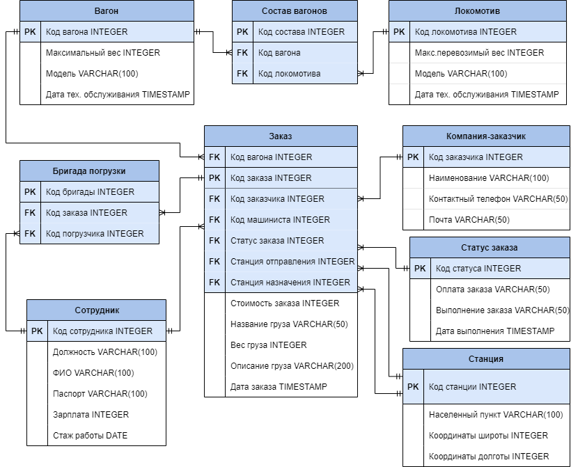

# Репозиторий курсовой работы по БД в 4 семестре
> _Тема БД курсовой работы: "Железная дорога"_
---
ER-диаграмма реализуемой БД:

_Для создания и заполнения всей БД достаточно в psql вбить команду \i '[Путь до проекта]\bd_4rd_sem_course_work\scripts\script_all.sql'._

> Используемые технологии разработки:
- PostgreSQL 14.2.2 - реализация самой БД
- Qt Creator 6.3.0 - приложение для визуализации работы с БД
- filldb - сайт для создания большого количества данных в БД

> Доступ к функциям будет соответствовать ролям.
> В бд будут роли:
- админ (доступ ко всему)
- машинист (доступ к своим заказам)
- погрузчик (доступ к своим заказам)
---
_На данный момент КР сдана, но сама программа еще не доведена до логического конца.
Возможно, когда-то позже я ее доделаю/рефакторну(как минимум второго тут точно не хватает)._
